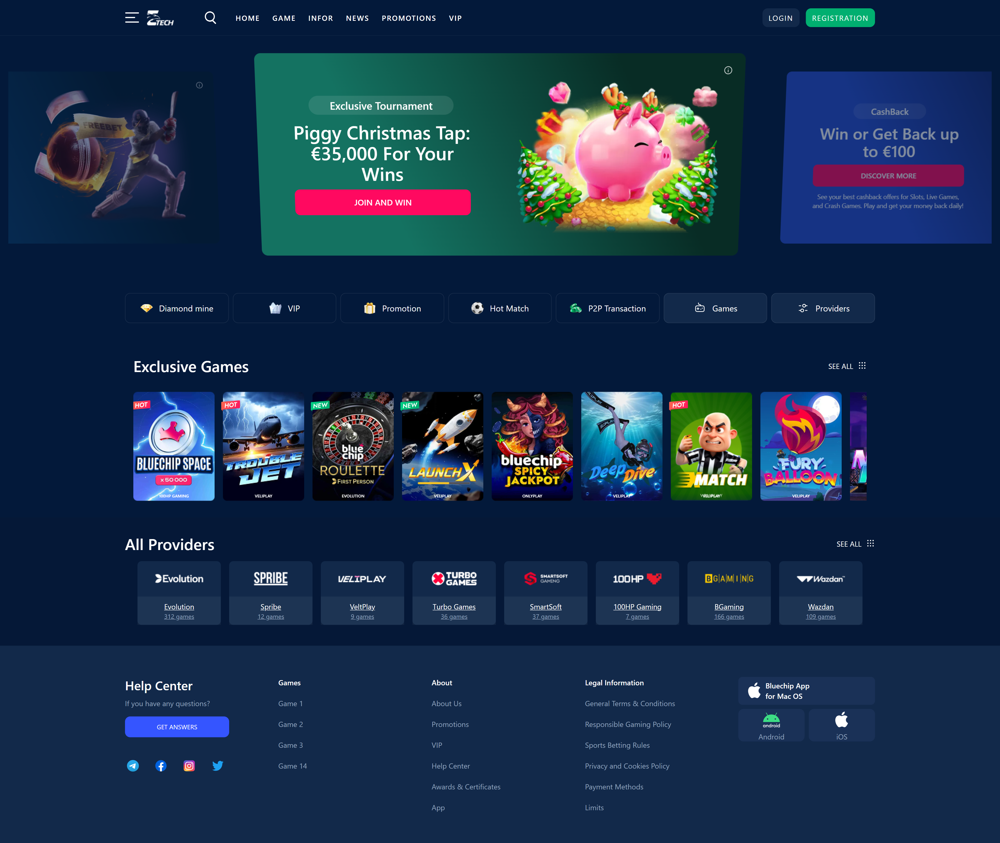

## Clone Project

git clone https://github.com/MinhLeos/nevel-tech.git

## Setup

Make sure to install dependencies:

```bash
# npm
npm install

# yarn
yarn install
```

## Development Server

Start the development server on `http://localhost:3000`:

```bash
# npm
npm run dev

# yarn
yarn dev
```

## Production

Build the application for production:

```bash
# npm
npm run build

# yarn
yarn build
```

Locally preview production build:

```bash
# npm
npm run preview

# yarn
yarn preview
```

## Screenshot

1. Desktop


1. Mobile

